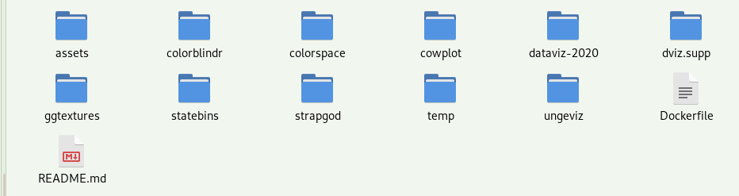
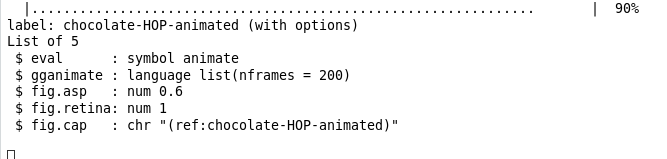
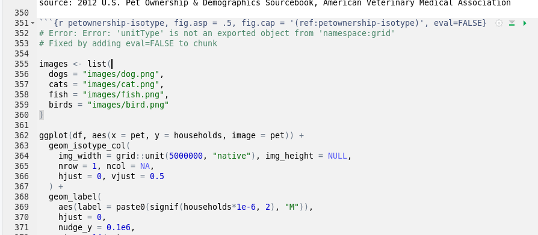

# dataviz 2020

This book "Fundamentals of Data Visualization` by Claus Wilke has been made fully reproducible using a Docker container. The compiled book can be [read online here](https://f0nzie.github.io/dataviz-wilke-2020/). The original repository of the book is in [GiHub at this link](https://github.com/clauswilke/dataviz), and can also be [reaed online here](https://serialmentor.com/dataviz/).

The book is great at learning advanced visualization techniques using R without focusing too much on the code but rather on universal, timeless best practices.


## Details
* R-3.6.3
* RStudio 1.2.5042
* Built using snapshots from MRAN at 2019-06-12

## Build and run the image

### Build the book with Docker

```
docker build -t fonzie/wilke:3.6.3 .
```

### Run the book with RStudio

```
docker run --rm -p 8787:8787 -v /home/msfz751/docker-share/wilke:/home/rstudio/share  -e USERID=$UID -e PASSWORD=wilke  fonzie/wilke:3.6.3
```

or better:

```
docker run --rm -p 38787:8787 \
    -v /home/msfz751/docker-share/wilke:/home/rstudio/share  \
    -e USERID=$UID -e PASSWORD=wilke \
     -v ${PWD}/dataviz-2020:/home/rstudio/book \
    fonzie/wilke:3.6.3
```

> Note. There is a script `run_docker.sh` that simplifies this.


## Publishing the book online
Send the publishing folder `/dataviz-2020/_book_final` to a subtree branch in GitHub gh-pages with:

```
 git subtree push --prefix dataviz-2020/_book_final origin gh-pages
 ```


## Packages and dependencies

### Build from source

These are the packages that are not in CRAN. The following packages are not in *CRAN* and need to be cloned to the same folder where the *Dockerfile* is residing. Later they will be copied to the container and built from source. All these are in the main folder:




* colorblindr
* colorspace
* cowplot
* dviz.supp
* ggtextures
* statebins
* strapgod
* ungeviz

### CRAN packages

* bookdown
* egg 
* emmeans
* forcats 
* foreign 
* gapminder 
* gganimate
* ggrepel 
* ggridges 
* ggthemes 
* ggforce 
* ggmap 
* ggplot2movies
* ggspatial
* gridGraphics
* gridExtra 
* geofacet 
* gtable
* hexbin
* lobstr
* lwgeom
* lubridate
* magick 
* maps 
* maptools 
* mvtnorm
* nycflights13 
* nlme
* patchwork
* plot3D
* readr 
* rgdal
* rgeos
* rworldmap
* rstanarm
* sf 
* statebins
* tidyverse 
* tidybayes
* treemapify 
* transformr
* units

   

### Other packages
At operating system level these packages need to be installed:

* libmagick++-dev
* libudunits2-dev 
* libgdal20 
* libgdal-dev 
* libgeos-dev  
* libproj-dev  

> These packages work for Debian 10.

## Chunks that take longer time to build

### In `visualizing_uncertainty.Rmd`




## Common errors

### `telling_a_story.Rmd`

This cannot be fixed yet.

```
# Error: Error: 'unitType' is not an exported object from 'namespace:grid'
# Fixed by adding eval=FALSE to chunk
```



### `figure_titles_captions.Rmd`, etc.

Apparently, yhis was fixed with new version of `statebins`.

```
# Error: Error: Corrupt `grouped_df` using old (< 0.8.0) format. ℹ Strip off old grouping with `ungroup()`.
# Fixed by adding ungroup(). Disabled.
```


## Dockerfile

```
FROM rocker/rstudio:3.6.3


RUN apt-get -y update \
 && apt-get -y install  \
    libxml2-dev \
    libz-dev

# Linux: pre-requisites gor GDAL, rgdal, rgeos and units
RUN apt-get install -y \
    libudunits2-dev \
    libgdal20 \
    libgdal-dev \
    libgeos-dev \ 
    libproj-dev     

# Linux: pre-requisites for magick
RUN apt-get install -y \
    libmagick++-dev


# Install R packages
RUN install2.r --error \
    egg \
    forcats \
    foreign \
    magick \
    maps \
    maptools \
    nlme \
    plot3D \
    rgdal \
    rgeos \
    sf \
    units

# Install R packages
RUN install2.r --error \
    gapminder \
    ggrepel \
    ggridges \
    ggthemes \
    ggforce \
    gridGraphics \
    ggplot2movies \
    gridExtra \
    gtable \ 
    hexbin \
    lubridate \
    nycflights13 \ 
    readr \
    treemapify \
    tidyverse \
    bookdown

# mvtnorm required by ungeviz
# rstanarm required by dviz.supp
# install statebins from source
RUN install2.r --error \
  rworldmap \
  lwgeom \
  mvtnorm \
  rstanarm

RUN install2.r --error \
  ggmap \
  geofacet \
  ggspatial
  
RUN install2.r --error \  
  emmeans \
  lobstr \
  gganimate \
  transformr


COPY colorspace /home/rstudio/pkg/colorspace
COPY strapgod /home/rstudio/pkg/strapgod
COPY ungeviz /home/rstudio/pkg/ungeviz
COPY cowplot /home/rstudio/pkg/cowplot
COPY colorblindr /home/rstudio/pkg/colorblindr
COPY dviz.supp /home/rstudio/pkg/dviz.supp
COPY ggtextures /home/rstudio/pkg/ggtextures
COPY statebins /home/rstudio/pkg/statebins

RUN Rscript -e "install.packages(c(\
  '/home/rstudio/pkg/colorspace', \
  '/home/rstudio/pkg/strapgod', \
  '/home/rstudio/pkg/ungeviz', \
  '/home/rstudio/pkg/cowplot', \
  '/home/rstudio/pkg/colorblindr', \
  '/home/rstudio/pkg/dviz.supp', \
  '/home/rstudio/pkg/ggtextures', \
  '/home/rstudio/pkg/statebins' \
  ), repos = NULL, type='source')"


RUN install2.r --error \  
  patchwork \
  tidybayes

COPY dataviz-2020 /home/rstudio/book
RUN chmod a+rwx -R /home/rstudio/book
```


## Scripts

### Build book script

```
#!/bin/sh

rm -rf ./_book_final/
Rscript -e "bookdown::render_book(input = 'index.Rmd', output_format = 'bookdown::gitbook', config_file = '_bookdown_final.yml')"

# copy the book to the shared folder in the host
cp -r _book_final/ ../share/

```


### bookdown.yaml

```
delete_merged_file: true
new_session: yes
output_dir: "_book_final"

rmd_files: [
  "index.Rmd",

  "preface.Rmd",
  "introduction.Rmd",

  # Part I
  "aesthetic_mapping.Rmd", # completed
  "coordinate_systems_axes.Rmd", # completed
  "color_basics.Rmd", # completed
  "directory_of_visualizations.Rmd",
  "visualizing_amounts.Rmd", # completed
  "visualizing_distributions_I.Rmd", # completed
  "visualizing_distributions_II.Rmd", # completed
  "boxplots_violins.Rmd", # completed
  "visualizing_proportions.Rmd", # completed
  "nested_proportions.Rmd", # completed
  "visualizing_associations.Rmd", # completed
  "time_series.Rmd", # completed
  "visualizing_trends.Rmd", # completed
  "geospatial_data.Rmd", # completed
  "visualizing_uncertainty.Rmd", # completed

  # Part II

  "proportional_ink.Rmd", # completed
  "overlapping_points.Rmd", # completed
  "pitfalls_of_color_use.Rmd", # completed
  "redundant_coding.Rmd", # completed
  "multi-panel_figures.Rmd", # completed
  "figure_titles_captions.Rmd", # completed
  "balance_data_context.Rmd", # completed
  "small_axis_labels.Rmd", # completed
  "avoid_line_drawings.Rmd", # completed
  "no_3d.Rmd", # completed

  # Part III
  "image_file_formats.Rmd", # completed
  "choosing_visualization_software.Rmd", # completed
  "telling_a_story.Rmd", # completed
  "annotated_bibliography.Rmd",

  "technical_notes.Rmd",

  "references.Rmd"
]

```


### common.R

```
set.seed(7654)
options(digits = 3)

knitr::opts_chunk$set(
  echo = FALSE,
  message = FALSE,
  warning = FALSE,
  cache = FALSE,
  #dpi = 105, # not sure why, but need to divide this by 2 to get 210 at 6in, which is 300 at 4.2in
  fig.align = 'center',
  fig.width = 6,
  fig.asp = 0.618,  # 1 / phi
  fig.show = "hold"
)

options(dplyr.print_min = 6, dplyr.print_max = 6)

library(dviz.supp)


```

